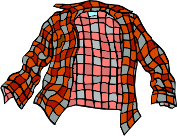

# TriviaGame

<h3>This is a Grunge music Trivia game, created to complete an assignment in the Penn LPS Coding Boot camp. </h3>

The trivia.js files includes an array of 30 objects, which are the trivia questions themselves. Each object holds the question, four possible responses (opt1-opt4) and the correct answer. The app.js runs the game code, selecting 15 random unique questions from the questions array and displaying them for the user. The user is given 15 seconds to answer the question, and if there is no response the correct answer is displayed. If the user clicks an answer within the 15 seconds, that timout is cancelled and the game checks if the user guessed correctly, and displays that info. This screen - whether reached by a response or non-response - is held for 3 seconds before the next question is displayed. 

The game tracks the number of correct, incorrect, and missed responses. This information is displayed after all 15 questions are completed. 

Game background photo by: https://www.pexels.com/@anniroenkae